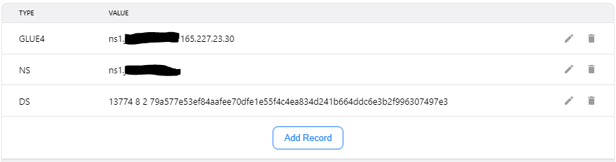
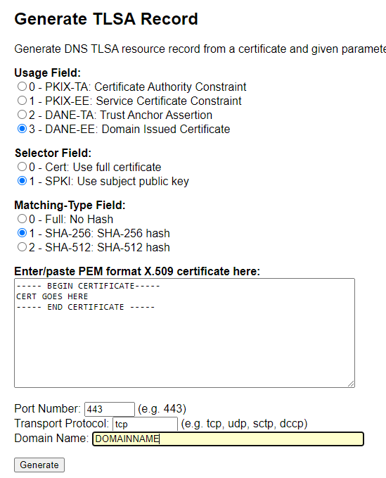

# Setting up DNSSEC and DANE with CoreDNS

This README covers adding DNSSEC and DANE capabilities to the CoreDNS stack you set up using the [basics guide.](../CoreDNS_basics/README.md) It's adapted from [Sebastian Rasor's tutorial.](https://ras.cr/handshake-tutorial.html)

## Assumptions

This assumes you're running on Ubuntu 18.04.

## Prerequisites

- A CoreDNS server actively serving zone records for your domain
- A valid zone file
- A handshake TLD in BOB wallet
- The following packages installed:

```
libldns-dev
hashalot 
bind9utils
```

## Install required tooling

To handle the required zone operations, we're going to install LDNS.

```
wget https://www.nlnetlabs.nl/downloads/ldns/ldns-1.7.1.tar.gz
tar -zxf ldns-1.7.1.tar.gz
cd ldns-1.7.1
./configure --with-examples --enable-dane

# AS ROOT / SUDO
make && make install

# Switch back to home dir for next steps
cd ~
mkdir dnssec && cd dnssec
```

## Generate the required keys

These commands will also set the basenames for the keypairs for later use. The generation takes a few minutes, so you might want to grab a beer or a coffee.

```
mkdir ksk && mkdir zsk
cd ksk
export KSK="$(ldns-keygen -k -a RSASHA256 -b 4096 DOMAINNAME)" 
cd ../zsk
export ZSK="$(ldns-keygen -a RSASHA256 -b 2048 DOMAINNAME)"
```

## Generate a zone signing salt

```
export SALTRAW="$(tr -dc A-Za-z0-9 </dev/urandom | head -c 1000 | cut -b 1-16)"
export SALT="$(hexdump -e '"%X"' <<< "$SALTRAW" | cut -b 1-16)"
unset SALTRAW
```

## Sign your zonefile

> The original tutorial advocates using the `-n` flag for NSEC3; it's omitted here as CoreDNS doesn't support it.

```
cp /path/to/zonefile ./zonefile
ldns-signzone -s "$SALT" zonefile ./ksk/$KSK ./zsk/$ZSK
```

You now have a signed zonefile - congratulations! Move it into place, edit your CoreDNS Corefile to use it, and then restart CoreDNS.

## DS record (BOB wallet)

In the `ksk` directory, there's a delegation signer (DS) file holding record info. You'll need some info from it:

```
cat ./keys/$KSK.ds | sed "s/.*DS[[:space:]]*//g"
```

Take this info, then go to your BOB wallet and update your domain with a DS record. Paste the info into the field and save your changes - be aware it can take up to 6 hours for these changes to take effect.



## Self-signed certificate

Now that the backend changes are done, you can create a certificate for a test website. Run the below command and enter your domain name for the `common name` section when prompted:

```
openssl req -newkey rsa:4096 -nodes -x509 -days 1825 -addext subjectAltName=DNS:DOMAINNAME -keyout DOMAINNAME.key -out DOMAINNAME.crt
```

This will spit out key and certificate files - you want the certificate (.crt) file, as we'll be using that as the endpoint TLS certificate for your site.

## Generate TLSA record

> This assumes you've already taken the certificate and set it up in Apache / Nginx etc. and it's available on port 443.

Open [Huque's TLSA generator](https://www.huque.com/bin/gen_tlsa) in a browser. Copy the raw content from your certificate file, leave the selectors at 3-1-1 as shown in the image, and hit generate.



This will spit out a one-line TLSA record for you. Copy it, paste it into your original, unsigned CoreDNS zone file at the end, and sign it.

```
cd ~/dnssec
ldns-signzone -s "$SALT" zonefile ./ksk/$KSK ./zsk/$ZSK
```

Move the new signed zonefile to allow CoreDNS to use it, and restart CoreDNS.

## Final testing

After at least 6 hours have passed (depending on HNS updates), you should be able to test DNSSEC integrity. The following sites are useful, both hosted on Handshake:

- https://sebastian.rasor/dane-verify/DOMAINNAME 
- http://dnssec.rithvik/analyze/DOMAINNAME 

## Gotchas to keep in mind

- Most browsers will still complain about self-signed certificates; exclusive DNSSEC / DANE adoption is not widespread.
- DS files expire annually, which will break the RRSIGs. 

