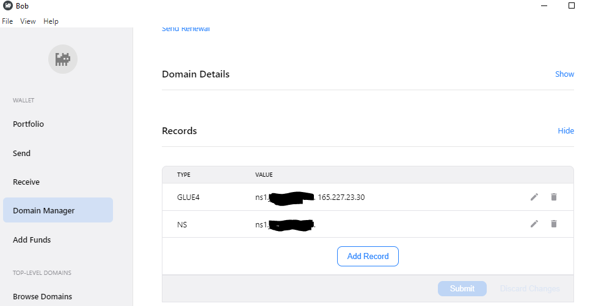

# CoreDNS HNS domain basics

This README covers the steps required in setting up a Handshake top level domain (HNS TLD), and the backing nameserver using CoreDNS.

## Assumptions

This assumes you're running on Ubuntu 18.04.

## Prerequisites

- A Linux server to host [CoreDNS](https://coredns.io/) with TCP & UDP port 53 open in any firewalls
- The external (public-facing) IP address of the CoreDNS nameserver
- [BOB wallet](https://bobwallet.io/)
- A HNS TLD 

## Assumptions

In the below example, the coredns user is `coredns` and their home directory is at `/home/coredns`. Feel free to change this.

## Configure your TLD records

In BOB, ensure you have your nameserver (NS) and GLUE4 records set up similar to the image below. The blacked out part will be your domain name / TLD, and the IP address will be the server you'll be hosting your CoreDNS records on.



## Configure CoreDNS

### Core & zone files

Once you've downloaded CoreDNS, set up a Corefile:

```
/home/coredns/coredns_conf/Corefile
```

```
.:53 {
   file /home/coredns/coredns_conf/zones/db.DOMAINNAME DOMAINNAME
   cache 300
   errors
   log
}
```

And set up a zone file, swapping DOMAINNAME for your TLD, and EXTERNAL_IP_ADDRESS for the public-facing IP address of the server hosting CoreDNS:

```
/home/coredns/coredns_conf/zones/db.DOMAINNAME
```

```
$ORIGIN DOMAINNAME.
$TTL    604800
@    IN    SOA    ns1.DOMAINNAME. admin.DOMAINNAME. (
                  3        ; Serial
             604800        ; Refresh
              86400        ; Retry
            2419200        ; Expire
             604800 )    ; Negative Cache TTL

; nameservers
@    IN    NS    ns1.DOMAINNAME.

; nameserver A records
ns1.DOMAINNAME.    IN    A    NS_EXTERNAL_IP_ADDRESS

; A records for the domain!
DOMAINNAME.    IN    A    DOMAIN_IP_ADDRESS

subdomain.DOMAINNAME.   IN      CNAME    DOMAINNAME.
subdomain2.DOMAINNAME.  IN      A        123.456.789.012
...
```

In this example, you can start CoreDNS with:

```
/path/to/coredns -conf /home/coredns/coredns_conf/Corefile
```

And test it with `dig`. You're looking for the `answer` and `authority` sections to be returned correctly:

```
coredns@sysbox:~$ dig @localhost DOMAINNAME

; <<>> DiG 9.11.3-1ubuntu1.14-Ubuntu <<>> @localhost DOMAINNAME
; (1 server found)
;; global options: +cmd
;; Got answer:
;; ->>HEADER<<- opcode: QUERY, status: NOERROR, id: 45892
;; flags: qr aa rd; QUERY: 1, ANSWER: 1, AUTHORITY: 1, ADDITIONAL: 1
;; WARNING: recursion requested but not available

;; OPT PSEUDOSECTION:
; EDNS: version: 0, flags:; udp: 4096
; COOKIE: 2def24cf223b237a (echoed)
;; QUESTION SECTION:
;DOMAINNAME.                        IN      A

;; ANSWER SECTION:
DOMAINNAME.         300     IN      A       NS_EXTERNAL_IP_ADDRESS

;; AUTHORITY SECTION:
DOMAINNAME.         300     IN      NS      ns1.DOMAINNAME.

;; Query time: 0 msec
;; SERVER: 127.0.0.1#53(127.0.0.1)
;; WHEN: Sun Mar 28 20:32:25 UTC 2021
;; MSG SIZE  rcvd: 131

```

Stop CoreDNS (ctrl+C) when done.

## Systemd service file

> It's not really recommended to run coredns as root, but ports under 1024 cannot be used without root privileges. You might want to look into iptables etc. redirects, which are outside the scope of this document.

To enable CoreDNS to start on boot, create the following service file at `/etc/systemd/system/coredns.service`:

```
[Unit]
Description=CoreDNS startup

[Service]
User=root
Type=simple
StandardOutput=journal
ExecStart=/home/coredns/coredns -conf /home/coredns/coredns_conf/Corefile

[Install]
WantedBy=default.target
```

Run `systemctl daemon-reload`, then `systemctl start coredns`. Check the status with `systemctl status coredns`:

```
root@sysbox:~# systemctl status coredns
● coredns.service - CoreDNS startup
   Loaded: loaded (/etc/systemd/system/coredns.service; enabled; vendor preset: enabled)
   Active: active (running) since Sun 2021-03-28 20:38:56 UTC; 20s ago
 Main PID: 27812 (coredns)
    Tasks: 9 (limit: 4915)
   CGroup: /system.slice/coredns.service
           └─27812 /home/coredns/coredns -conf /home/coredns/coredns_conf/Corefile

Mar 28 20:38:56 sysbox systemd[1]: Started CoreDNS startup.
Mar 28 20:38:56 sysbox coredns[27812]: .:53
Mar 28 20:38:56 sysbox coredns[27812]: CoreDNS-1.8.3
Mar 28 20:38:56 sysbox coredns[27812]: linux/amd64, go1.16, 4293992
Mar 28 20:39:10 sysbox coredns[27812]: [INFO] 127.0.0.1:55706 - 35651 "A IN DOMAINNAME. udp 55 false 4096" NOERROR q
```

If it looks good, you can run more dig tests like above as a final sanity check. 

## HNS Resolution testing

To confirm everything is normal, you can try browsing to resources if you've already got them set up in browsers like:

- [Brave](https://brave.com)
- [Puma](https://www.pumabrowser.com/)
- Firefox (with the [Resolvr](https://addons.mozilla.org/en-CA/firefox/addon/resolvr/) addon, but this may not be totally reliable)

If you want raw data on how your TLD is resolving in the Handshake network, you can run a dig query against a public-facing endpoint. Some of these are:

- 103.196.38.38 & 103.196.38.39 [HDNS at namebase](https://hdns.io)

You should see an A record returned for the domain. 

```
coredns@sysbox:~$ dig @103.196.38.38 DOMAINNAME

; <<>> DiG 9.11.3-1ubuntu1.14-Ubuntu <<>> @103.196.38.38 DOMAINNAME
; (1 server found)
;; global options: +cmd
;; Got answer:
;; ->>HEADER<<- opcode: QUERY, status: NOERROR, id: 48057
;; flags: qr rd ra; QUERY: 1, ANSWER: 1, AUTHORITY: 0, ADDITIONAL: 1

;; OPT PSEUDOSECTION:
; EDNS: version: 0, flags:; udp: 4096
;; QUESTION SECTION:
;DOMAINNAME.                        IN      A

;; ANSWER SECTION:
DOMAINNAME.         300     IN      A       EXTERNAL_IP_ADDRESS

;; Query time: 342 msec
;; SERVER: 103.196.38.38#53(103.196.38.38)
;; WHEN: Sun Mar 28 20:49:17 UTC 2021
;; MSG SIZE  rcvd: 59

```

You can also query the nameservers to make sure it looks sane.

```
coredns@sysbox:~$ dig NS @103.196.38.38 DOMAINNAME

; <<>> DiG 9.11.3-1ubuntu1.14-Ubuntu <<>> NS @103.196.38.38 DOMAINNAME
; (1 server found)
;; global options: +cmd
;; Got answer:
;; ->>HEADER<<- opcode: QUERY, status: NOERROR, id: 29824
;; flags: qr rd ra; QUERY: 1, ANSWER: 1, AUTHORITY: 0, ADDITIONAL: 1

;; OPT PSEUDOSECTION:
; EDNS: version: 0, flags:; udp: 4096
;; QUESTION SECTION:
;DOMAINNAME.                        IN      NS

;; ANSWER SECTION:
DOMAINNAME.         300     IN      NS      ns1.DOMAINNAME.

;; Query time: 21 msec
;; SERVER: 103.196.38.38#53(103.196.38.38)
;; WHEN: Sun Mar 28 20:52:28 UTC 2021
;; MSG SIZE  rcvd: 61

```

If this looks good, you're in business!